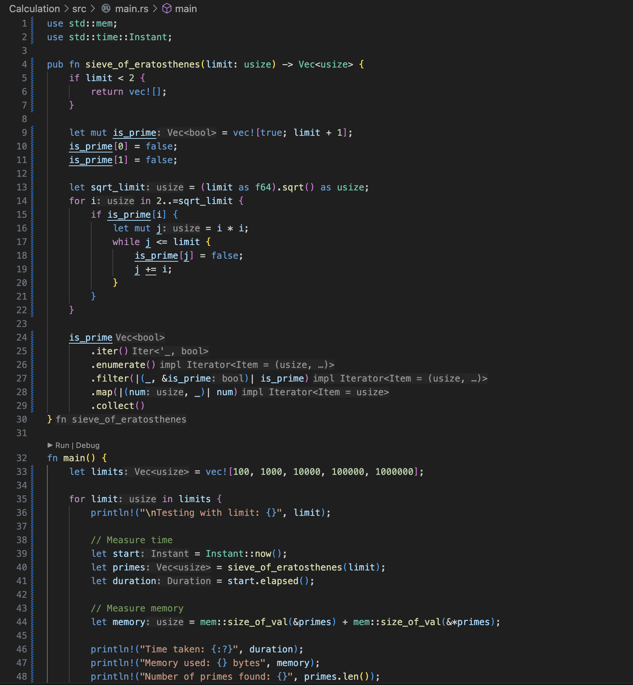

[](https://github.com/nogibjj/Jennifer_Mini7_Package_Python_Script_Rust/actions/workflows/CI.yml)

# Mini Project 7: Package a Python Script into a Command-Line Tool Using Rust

## Project Purpose
This project aims to package a Python Script into a Rust-based Command-Line Tool for calculating statistical values of sum and mean. The tool is packaged in Rust and can be built for both development and release modes. This Readme acts as a user guide to help you get started with installing and using the tool , enjoy ~ 

## Project Structure


*Features*
* Built with Rust for performance and safety
* Command-line interface using clap
* Calculate the sum and mean of two integers

## Project Prerequisites
Before you can build and use the tool, make sure you have the following installed on your system:
* Rust (latest stable version recommended)
* Cargo (Rust's package manager, included with Rust)

## Tool Installation & Development
You can follow the steps below to install and build the command-line tool: 

### Clone the Repository
Clone this repository: 

```
git clone https://github.com/nogibjj/Jennifer_Mini7_Package_Python_Script_Rust.git
cd Calculation
```

### Build the Project

#### Cargo Check
`Cargo check` is a Rust command that quickly checks your code for errors without compiling an executable, making it faster than cargo build for iterative development.


#### Cargo Build
To compile the project, you can choose between development and release builds:
* If you are working on the project or want faster builds with debug symbols: `cargo build`


* For optimized performance and a smaller binary: `cargo build --release`



## Tool Usage

Once the tool is built, you can use it via the command line. The tool accepts two integer numbers as command-line arguments for calculating the sum and mean.

To execute the tool:
`Cargo run <num1> <num2>`

*Example Commands* 


## Artifact Screenshot


## Reference
https://github.com/johncoogan53/Rust-Template

